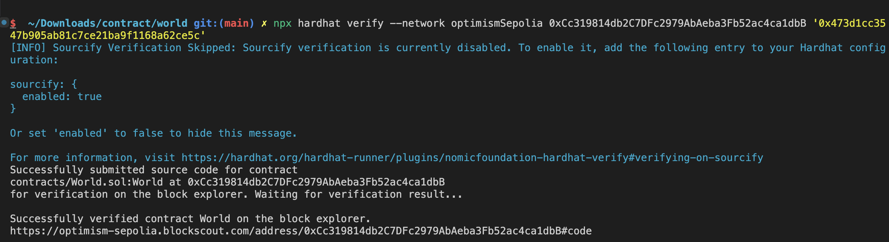

# Sample Hardhat Project

This project demonstrates a basic Hardhat use case. It comes with a contract generated by [OpenZeppelin Wizard](https://wizard.openzeppelin.com/), a test for that contract, and a script that deploys that contract.

## Installing dependencies

```
npm install
```

## Testing the contract

```
npm test
```

## Deploying the contract

You can target any network from your Hardhat config using:

```
npx hardhat run --network <network-name> scripts/deploy.ts
```

## sepolia
npx hardhat run scripts/deploy.ts --network sepolia

npx hardhat verify --network sepolia DEPLOYED_CONTRACT_ADDRESS "Hello, Hardhat!"
<!-- 执行合约的构造方法 -->
npx hardhat verify --network sepolia 0xf0E90c998e1A4240cb48732C621E193fCF68875D

npx hardhat run scripts/deploy.ts --network sepolia

0xbbaca69f378760837b5428833db97457ee4cb4be


npx hardhat verify --network sepolia 0xCc319814db2C7DFc2979AbAeba3Fb52ac4ca1dbB '0x473d1cc3547b905ab81c7ce21ba9f1168a62ce5c'


```
$  ~/Downloads/contract/world git:(main) npx hardhat verify --network sepolia 0xCc319814db2C7DFc2979AbAeba3Fb52ac4ca1dbB '0x473d1cc3547b905ab81c7ce21ba9f1168a62ce5c'
[INFO] Sourcify Verification Skipped: Sourcify verification is currently disabled. To enable it, add the following entry to your Hardhat configuration:

sourcify: {
  enabled: true
}

Or set 'enabled' to false to hide this message.

For more information, visit https://hardhat.org/hardhat-runner/plugins/nomicfoundation-hardhat-verify#verifying-on-sourcify
The contract 0xCc319814db2C7DFc2979AbAeba3Fb52ac4ca1dbB has already been verified on the block explorer. If you're trying to verify a partially verified contract, please use the --force flag.
https://sepolia.etherscan.io/address/0xCc319814db2C7DFc2979AbAeba3Fb52ac4ca1dbB#code
```


## baseSepolia

$  ~/Downloads/contract/world git:(main) ✗ npx hardhat run scripts/deploy.ts --network baseSepolia
Contract deployed to 0xCc319814db2C7DFc2979AbAeba3Fb52ac4ca1dbB

npx hardhat verify --network baseSepolia 0xCc319814db2C7DFc2979AbAeba3Fb52ac4ca1dbB '0x473d1cc3547b905ab81c7ce21ba9f1168a62ce5c'


$  ~/Downloads/contract/world git:(main) ✗ npx hardhat run scripts/deploy.ts --network optimismSepolia
Contract deployed to 0xCc319814db2C7DFc2979AbAeba3Fb52ac4ca1dbB
npx hardhat verify --network optimismSepolia 0xCc319814db2C7DFc2979AbAeba3Fb52ac4ca1dbB '0x473d1cc3547b905ab81c7ce21ba9f1168a62ce5c'


```sh
$  ~/Downloads/contract/world git:(main) ✗ npx hardhat verify --network baseSepolia 0xCc319814db2C7DFc2979AbAeba3Fb52ac4ca1dbB '0x473d1cc3547b905ab81c7ce21ba9f1168a62ce5c'
[INFO] Sourcify Verification Skipped: Sourcify verification is currently disabled. To enable it, add the following entry to your Hardhat configuration:

sourcify: {
  enabled: true
}

Or set 'enabled' to false to hide this message.

For more information, visit https://hardhat.org/hardhat-runner/plugins/nomicfoundation-hardhat-verify#verifying-on-sourcify
Successfully submitted source code for contract
contracts/World.sol:World at 0xCc319814db2C7DFc2979AbAeba3Fb52ac4ca1dbB
for verification on the block explorer. Waiting for verification result...

Successfully verified contract World on the block explorer.
https://sepolia.basescan.org/address/0xCc319814db2C7DFc2979AbAeba3Fb52ac4ca1dbB#code
```

## optimismSepolia
```sh
$  ~/Downloads/contract/world git:(main) ✗ npx hardhat verify --network optimismSepolia 0xCc319814db2C7DFc2979AbAeba3Fb52ac4ca1dbB '0x473d1cc3547b905ab81c7ce21ba9f1168a62ce5c'
[INFO] Sourcify Verification Skipped: Sourcify verification is currently disabled. To enable it, add the following entry to your Hardhat configuration:

sourcify: {
  enabled: true
}

Or set 'enabled' to false to hide this message.

For more information, visit https://hardhat.org/hardhat-runner/plugins/nomicfoundation-hardhat-verify#verifying-on-sourcify
Successfully submitted source code for contract
contracts/World.sol:World at 0xCc319814db2C7DFc2979AbAeba3Fb52ac4ca1dbB
for verification on the block explorer. Waiting for verification result...

Successfully verified contract World on the block explorer.
https://optimism-sepolia.blockscout.com/address/0xCc319814db2C7DFc2979AbAeba3Fb52ac4ca1dbB#code

```


## arbitrumSepolia   
```sh
$  ~/Downloads/contract/world git:(main) ✗ npx hardhat run scripts/deploy.ts --network arbitrumSepolia               
Contract deployed to 0xCc319814db2C7DFc2979AbAeba3Fb52ac4ca1dbB
$  ~/Downloads/contract/world git:(main) ✗ 


npx hardhat verify --network arbitrumSepolia 0xCc319814db2C7DFc2979AbAeba3Fb52ac4ca1dbB '0x473d1cc3547b905ab81c7ce21ba9f1168a62ce5c'


$  ~/Downloads/contract/world git:(main) ✗ npx hardhat verify --network arbitrumSepolia 0xCc319814db2C7DFc2979AbAeba3Fb52ac4ca1dbB '0x473d1cc3547b905ab81c7ce21ba9f1168a62ce5c'
[INFO] Sourcify Verification Skipped: Sourcify verification is currently disabled. To enable it, add the following entry to your Hardhat configuration:

sourcify: {
  enabled: true
}

Or set 'enabled' to false to hide this message.

For more information, visit https://hardhat.org/hardhat-runner/plugins/nomicfoundation-hardhat-verify#verifying-on-sourcify
Successfully submitted source code for contract
contracts/World.sol:World at 0xCc319814db2C7DFc2979AbAeba3Fb52ac4ca1dbB
for verification on the block explorer. Waiting for verification result...

Successfully verified contract World on the block explorer.
https://sepolia.arbiscan.io/address/0xCc319814db2C7DFc2979AbAeba3Fb52ac4ca1dbB#code
```